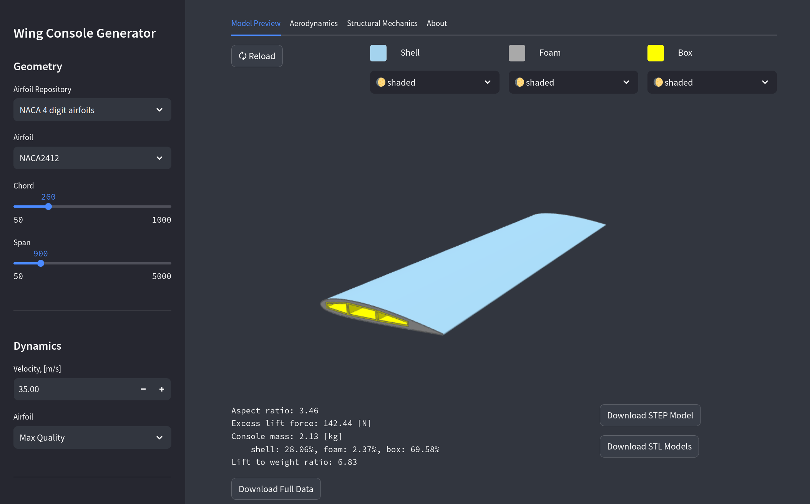

# UAV Wing Console Generator

Rectangular Wing Console (v1.0)

Streamlit app based on the [CQ-UAV](https://github.com/nomad-vagabond/cq-uav) library for generation of UAV components with [CadQuery](https://github.com/CadQuery/cadquery) and [SplineCloud](https://splinecloud.com/).


---



## Mathematical Model of The Wing Console

### Assumptions
- considered uniform distribution of pressure along the wing span (which is not true in reality);
- UAV pitch angle = 0, meaning horizontal flight mode with arbitrary angle of attack;
- only the wing box section accepts aerodynamic load, which is applied along the central line of the wing box;
- pure box bending is considered;
- wing console is fixed on one of its ends, another end is free;
- wing materials are isotropic.

### Geometry

Wing consists of three main parts: three-chamber box compartment (inner body), shell and interim body (XPS foam or other low-density material)

Geometry is automatically reenerated based on the airfoil type and wing size.


## Airfoil data

Airfoil data (profile geometry and aerodynamic coefficients) are collected from the open SplineCloud repositories with the script from the cq-uav library. Airfoil shapes are approximated with smoothing B-Splines, while sharp tails are thickened to avoid malformed geometry.

## To Run Locally

1. Clone this [repository](https://github.com/nomad-vagabond/streamlit-wing-design) with git

2. Open terminal and `cd` to th cloned repository

#### a) Using docker-compose (recommended)

3. In terminal

```
docker-compose up --build
```

4. In browser go to `http://localhost:8501/`

#### b) Using virtual environment

3. Create virtual environment

```
python -m venv venv
```

4. Install dependencies

```
. ./venv/bin/activate

pip install -r requirements.txt
```

5. Run the streamlit app

```
streamlit run app/app.py
```

6. A browser window (tab) with the app should appear.

---

Inspired by [obeliskterrain](https://github.com/medicationforall/obeliskterrainapp/tree/main)
